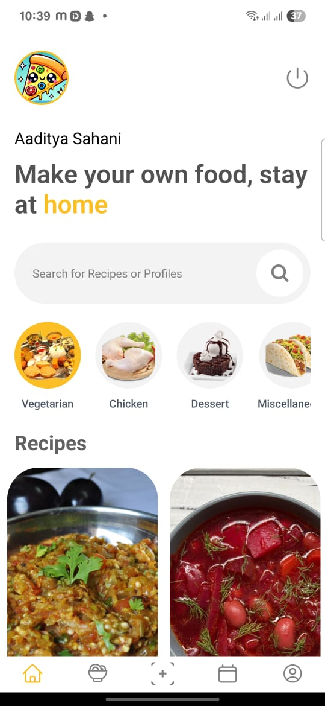
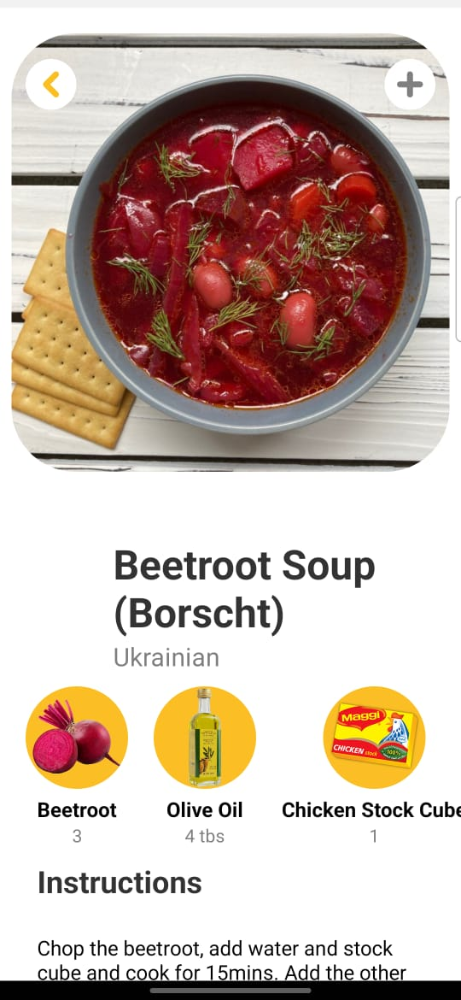

---

````md
# MealMate 🍽️

MealMate is a cutting-edge social mobile application that combines recipe sharing, intelligent meal planning, and social networking — built using React Native (Expo), Firebase, and Node.js.

## 📱 Features

- 🧑‍🍳 **Recipe Sharing**: Users can upload, explore, and favorite recipes with ingredients, steps, and photos.
- 🗓️ **Meal Planning**: Drag-and-drop calendar for personalized weekly/monthly plans.
- 🍱 **Nutrition Tracking**: Calculate calories, macronutrients, and align meals with dietary goals.
- 🤝 **Social Features**: Follow other users, like and comment on meals, and share your kitchen creations.
- 🛒 **Ingredient Management**: Smart shopping lists and pantry tracking.
- 🔍 **Recipe Discovery**: Advanced search with filters (cuisine, diet, time, etc.) and personalized recommendations.
- 🔔 **Notifications**: Get alerts on interactions, meals, and new content.
- 🛡️ **Secure Auth**: Firebase Authentication with support for social login.

## 🛠️ Tech Stack

| Layer         | Technology                 |
|--------------|----------------------------|
| Frontend     | React Native (Expo)        |
| Backend      | Node.js + Express.js       |
| Database     | Firebase Firestore         |
| Auth & Storage| Firebase Authentication & Cloud Storage |
| State Mgmt   | Redux                      |
| External API | [TheMealDB API](https://www.themealdb.com/api.php) |
| Dev Tools    | GitHub, VS Code, Postman, Firebase CLI |

## 🧩 Screenshots

| Home Feed | Recipe Detail | Profile |
|-----------|---------------|---------|
|  |  |  |

> Add actual screenshots to the `screenshots/` folder.

## 📦 Installation

### Prerequisites

- Node.js ≥ 14
- Expo CLI
- Firebase Project (setup Firestore, Auth, Storage)

### Run Locally

```bash
git clone https://github.com/aaditya7788/MealMate.git
cd MealMate_server
npm run dev
````

#Open new terminal


```bash
git clone https://github.com/aaditya7788/MealMate.git
cd MealMate_server
npm run dev
````

### Backend

Configure functions and database rules as per `/functions/`.

## 📥 Download App

APK (Android): [Click to Download](https://tinyurl.com/3skxk72b)
iOS (via TestFlight): *Coming soon*

## 🛡️ Security

* Encrypted user data
* Secure JWT authentication
* Privacy settings and content moderation

## 🚀 Future Enhancements

* Offline access to recipes
* Multilingual support


## 👨‍💻 Authors

* [Aaditya Sahani](https://github.com/aaditya7788)
* [Binit Gupta](https://github.com/yourpartnergithub)

## 📄 License

This project is licensed under the MIT License.

---

